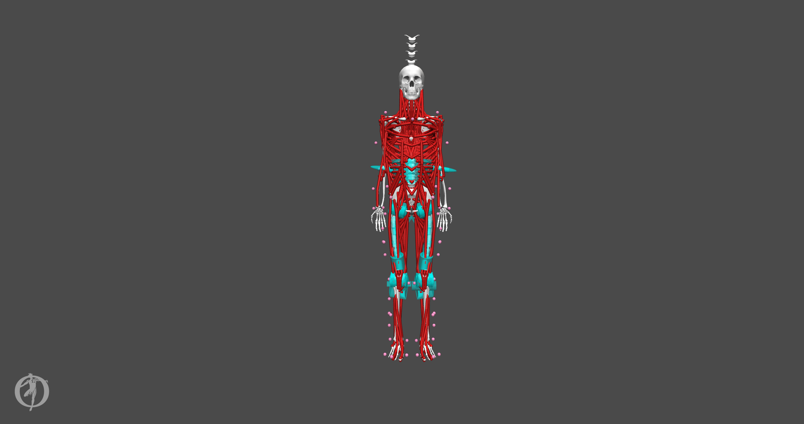

# opensim-model-fullBodyMuscleActuated

OpenSim full-body muscle-actuated model and scaling files.

| Author(s) | Brief Description | Intended Uses and Known Limitations | Included Material | Updated |
|-|-|-|-|-|
| Adapted by Ross Wilkinson, Ph.D. | A full-body, muscle-actuated human model adapted from the full-body model by Rajagopal et al. (2016) updated by Lai et al. (2017), torso model by Allaire et al. (2020), and arm model by Saul et al. (2015) updated by McFarland et al. (2019). | Predicting muscle power and metabolic cost of standing cycling in OpenSim-Moco. Need to simplify upper-body actuators to speed up simulations. Inaccurate display of vertebrae geometries. | Model file and scaling task files. | April 10, 2021 |

## Example

1. Open the model file (cyclistFullBodyMuscle.osim) in OpenSim 4.1 (File>Open Model...).
2. Open the ScaleTool (Tools>Scale Model...).
3. Load the 'setupScale_s01.xml' file into the ScaleTool.
4. Run ScaleTool and check outputs.

The user can edit the models marker locations, marker pairs, and scaling tasks to suit their unique experimental marker set and scaling requirements. Please refer to the documentation at <https://simtk-confluence.stanford.edu:8443/display/OpenSim/OpenSim+Documentation> for more information on the scaling process in OpenSim.
